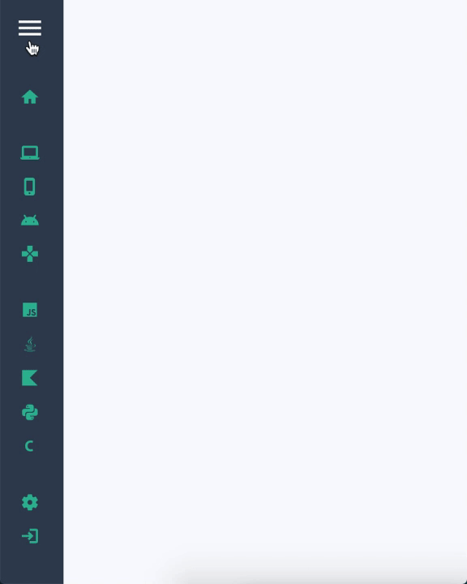

# lilypads-toggle-sidebar
    


A light-weight reusable Js+Css toggle sidebar. 



Everything is encapsulated in the following 3 namespaces. No name polusion will be introduced into your project. 
1. `lilypads-toggle-sidebar`
2. `lilypads-toggle-sidebar-container`
3. `lilypads-toggle-sidebar-main`

## Usage
Download and unzip the release `v1.0.zip` package, the following 3 files are required.
```
.
├── css
│   └── lilypads-toggle-sidebar.css
├── index.html
└── js
    └── lilypads-toggle-sidebar.js
```

You can work directly on `index.html` file, or craft your own page base on it.

To include the `lilypads-toggle-sidebar.js` into your own Javascript file, add these two lines,
```js
import { lilypadsToggleSidebar } from './js/lilypads-toggle-sidebar.js';
lilypadsToggleSidebar.init();
```

To import the `lilypads-toggle-sidebar.css`, 
```css
@import url('./css/lilypads-toggle-sidebar.css');
```

Happy coding!
